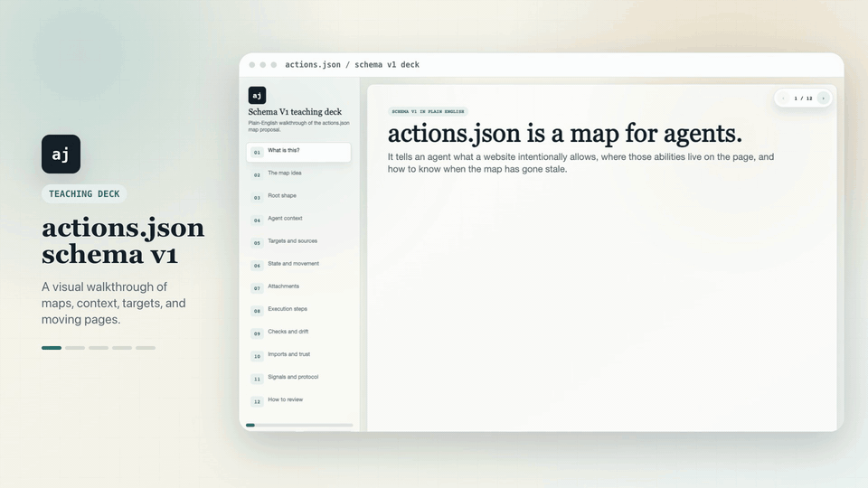

# actions.json

`actions.json` is a readable action map for websites.

It lets agents discover what a site can do, call declared actions, and reuse
website knowledge instead of scraping, guessing, or rediscovering the same DOM
every run.

The category claim is simple: OpenAPI described servers. `actions.json`
describes website actions.

<p align="center">
  <a href="https://yaniv256.github.io/actions.json/decks/schema-v1-proposal-deck.html">
    
  </a>
</p>

## What You Can Do Now

This repository contains the current public reference implementation for:

- writing `actions.json` maps with an agent authoring skill;
- running a Chrome extension that can host a GPT Realtime browser agent with
  your own OpenAI API key;
- loading `actions.json.storage` so the hosted agent can use site-specific
  context and actions;
- exposing actions to external coding agents through an MCP-shaped bridge;
- testing the page-JavaScript/embed path through the bookmarklet runtime;
- rendering in-page overlays, launchers, screenshots, and structured reports.

The project is pre-1.0. The schema, primitive dictionary, bridge protocol, and
runtime split are still active design surfaces. Current docs distinguish
implemented behavior from future direction.

## Choose Your Path

### I Want An Agent On The Current Website

Install the Chrome extension, authorize a tab, open the `actions.json` menu, add
your OpenAI API key, and start the hosted agent from the Agent tab.

The extension-hosted agent can:

- speak and listen through `gpt-realtime-2`;
- use screenshots after tab authorization;
- use uploaded storage to discover and run current-site actions;
- use direct primitives such as `browser.screenshot`, `locator.element_info`,
  `viewport.scroll`, and `pointer.click`;
- keep transcript and session diagnostics in extension storage;
- keep the live voice session in an extension-owned offscreen document so page
  overlay reinjection does not intentionally restart the session.

Read [Hosted Agent](docs/hosted-agent.md) and
[Chrome Extension](docs/chrome-extension.md).

### I Want My Coding Agent To Operate A Website

Use the authoring skill and the MCP-shaped bridge. The coding agent explores a
site, writes or improves `actions.json`, syncs storage, asks `actions.site` what
actions are available, and then calls stored actions instead of rediscovering
the page. From the user's point of view, you ask the coding agent to inspect the
site, write the map, test it, and save the reusable actions.

Read [Getting Started](docs/getting-started.md),
[Bridge Architecture](docs/bridge-architecture.md), and the authoring skill at
[skills/SKILL.md](skills/SKILL.md).

### I Want To Make My Website Agent-Ready

Write an official `actions.json` for your site. Use it to describe important
workflows, page context, product or documentation knowledge, navigation targets,
and safe actions. A first-party action map gives agents the official context for
how your website should be understood and operated.

Read [actions.json Format](docs/actions-json-format.md),
[Schema V1 Reference](docs/schema-v1-proposal.md), and
[actions.json.storage](docs/actions-json-storage.md).

### I Want To Test The Embed Path

Use the bookmarklet/runtime shell to test what can be done from page
JavaScript. This approximates a future first-party website embed, but it is less
capable than the extension because host pages can block local transport, affect
overlay styling, and require user consent for screenshots.

Read [Getting Started](docs/getting-started.md) and
[Runtime README](runtime/actions-json-runtime/README.md).

## Runtime And Bridge Model

`actions.json` is the map. A browser runtime interprets the map. An agent
adapter translates model or MCP tool calls into runtime actions.

Current runtime hosts:

- **Chrome extension**: preferred authoring and hosted-agent runtime. It has tab
  authorization, screenshots, storage upload/download, overlay UI, debugger
  fallback for authoring, and durable hosted voice sessions.
- **Bookmarklet/runtime shell**: lightweight page-JavaScript runtime for
  bookmarklet and future embed-path testing.
- **MCP-shaped bridge**: external-agent adapter that exposes stable HTTP
  tool-list and tool-call endpoints and routes calls to connected browser
  runtimes. It is not yet a fully conforming MCP server.

The hosted extension agent does not require the local bridge for its local tool
catalog or uploaded storage-backed `actions.site` actions. External coding
agents still use the bridge.

## Install Or Try It

For normal use, install release artifacts instead of building from source.
Start with [Getting Started](docs/getting-started.md).

For source development:

```bash
npm install
npm run test:runtime
npm run test:overlay-runtime
node scripts/validate-skills.mjs
```

Run the bridge from source when you need an external coding agent to connect:

```bash
cargo run --manifest-path mcp/actions-json-mcp/Cargo.toml -- serve \
  --actions extensions/chrome-overlay-runtime/actions/overlay.actions.json \
  --storage-root ../actions.json.storage
```

## Repository Map

```text
docs/                         Public documentation and schema references
skills/SKILL.md               Canonical installable authoring skill
skills/references/            Skill reference docs, symlinked to public docs
runtime/actions-json-runtime/ Shared runtime and bookmarklet code
extensions/chrome-overlay-runtime/
                              Chrome extension runtime and hosted-agent UI
mcp/actions-json-mcp/         MCP-shaped bridge for external agents
examples/                     Public examples
adapters/                     Packaging glue for agent ecosystems
specs/                        Spec Kit feature work and task records
scripts/                      Packaging and validation scripts
tests/                        Repository-level tests
```

Internal planning and private PR notes do not belong in public docs. Public docs
should describe user-facing behavior, stable architecture, or clearly marked
implementation-pending design.

## Documentation

Start here:

- [Documentation Index](docs/index.md)
- [Getting Started](docs/getting-started.md)
- [Hosted Agent](docs/hosted-agent.md)
- [Chrome Extension](docs/chrome-extension.md)
- [Troubleshooting](docs/troubleshooting.md)

Reference:

- [actions.json Format](docs/actions-json-format.md)
- [Schema V1 Reference](docs/schema-v1-proposal.md)
- [Bridge Architecture](docs/bridge-architecture.md)
- [Actions Bridge Protocol](docs/actions-bridge-protocol.md)
- [Primitive Dictionary Architecture](docs/primitive-dictionary-architecture.md)
- [Hosted Agent Tools](docs/hosted-agent-tools.md)
- [actions.json.storage](docs/actions-json-storage.md)
- [Storage Visibility Scopes](docs/storage-visibility-scopes.md)
- [Repository Structure](docs/repo-structure.md)

## Status And Boundaries

The Chrome extension requires user authorization for browser tabs. The hosted
agent uses the OpenAI API key you store in Chrome extension storage. The
debugger fallback is for authoring and repair, not normal product actions. Site
policies, browser permissions, CSP, and microphone settings can limit what a
runtime can do.

## License

MIT
